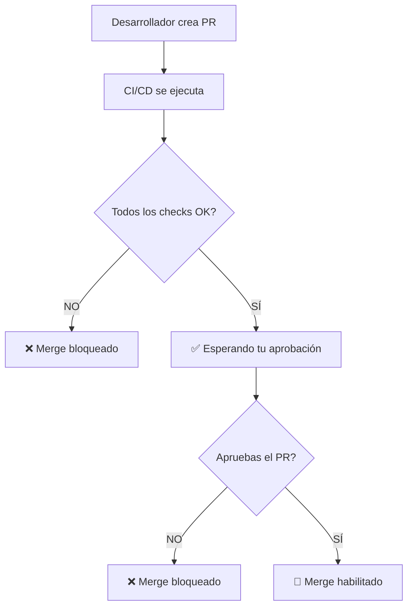

# 🔒 Configuración Branch Protection - Guía Rápida

## 🎯 Objetivo
- **Solo tú** puedes aprobar PRs
- **Botón Merge deshabilitado** hasta que CI/CD esté OK
- **Control total** sobre la integración de código

---

## 📋 Pasos de Configuración

### 1. Acceder a Settings
```
GitHub → Tu Repositorio → Settings → Branches
```

### 2. Crear Regla para `develop`
1. Click **"Add rule"**
2. **Branch name pattern:** `develop`

### 3. Configurar Reglas Obligatorias

#### ✅ **Require a pull request before merging**
- **Require approvals:** `1`
- ✅ **Dismiss stale reviews when new commits are pushed**
- ✅ **Require review from code owners**
- ✅ **Restrict reviews to code owners**

#### ✅ **Require status checks to pass before merging**
- ✅ **Require branches to be up to date before merging**
- **Status checks requeridos:**
  - `🔍 Code Quality & Security`
  - `🏗️ Build & Test`
  - `🔒 Security Scan`
  - `🐳 Docker Build`

#### ✅ **Require conversation resolution before merging**

#### ✅ **Require linear history**

#### ✅ **Do not allow bypassing the above settings**

### 4. Repetir para `main` (opcional)

---

## 🔧 Configuración CODEOWNERS

Tu archivo `.github/CODEOWNERS` ya está configurado correctamente:

```bash
# Solo carlos-2790 es el code owner
* @carlos-2790
```

---

## 🚀 Resultado Final

### ✅ **Lo que PASARÁ:**
- PRs requieren tu aprobación obligatoria
- Merge bloqueado hasta que CI/CD pase
- Solo tú recibes notificaciones de review
- Historial limpio y controlado

### ❌ **Lo que NO PODRÁN hacer otros:**
- Aprobar PRs
- Hacer merge sin tu aprobación
- Saltarse los checks de CI/CD
- Push directo a `develop`

---

## 📊 Flujo de Trabajo



---

## ⚡ Comandos de Emergencia (Solo para ti)

```bash
# Bypass temporal (solo admin)
# Se hace desde GitHub UI con permisos admin

# Forzar push (emergencias)
git push --force-with-lease origin develop
```

---

## 🔔 Configurar Notificaciones

**GitHub → Settings → Notifications:**
- ✅ Pull request reviews
- ✅ Pull request pushes
- ✅ Actions workflow runs

---

**🎯 Con esta configuración tendrás control total sobre tu repositorio mientras mantienes la automatización del CI/CD.** 